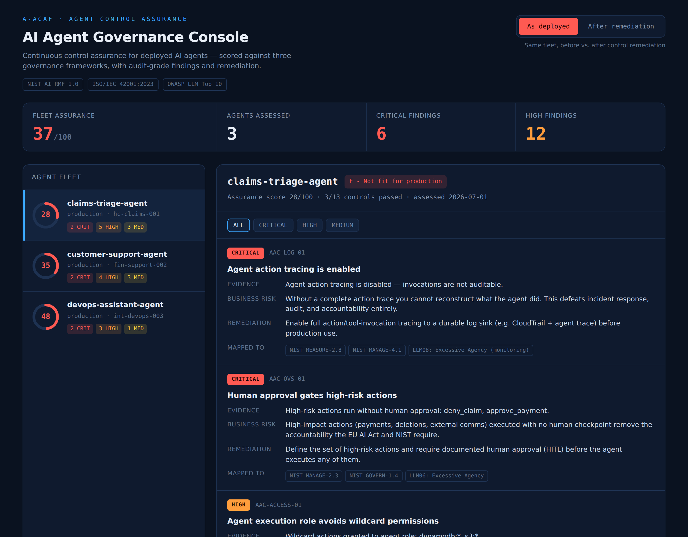
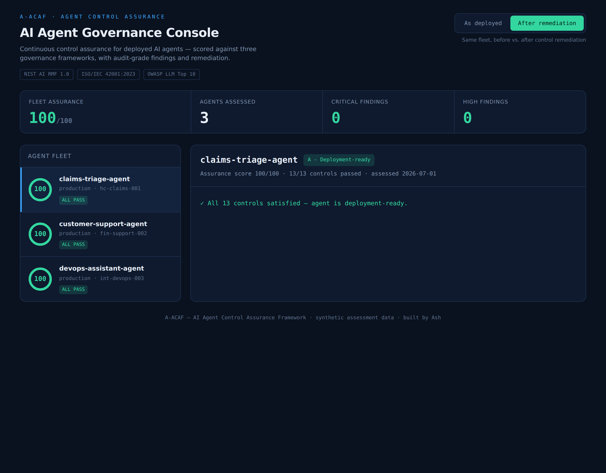
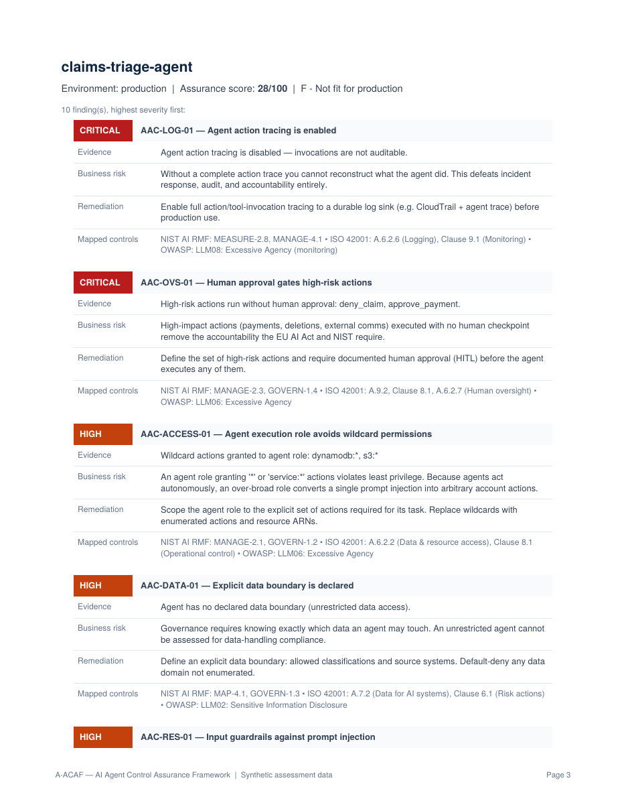
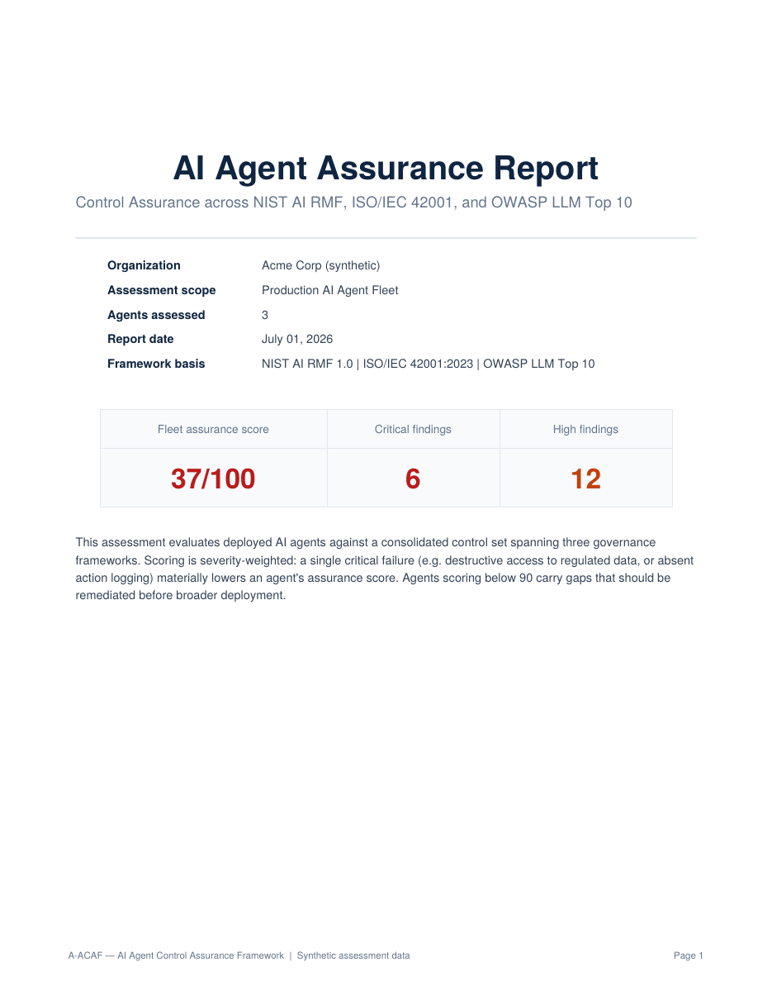

# A-ACAF — AI Agent Control Assurance Framework

**Continuous governance and control assurance for deployed AI agents — scored against NIST AI RMF, ISO/IEC 42001, and the OWASP LLM Top 10.**

🔗 **Live console:** https://ashwatha4502.github.io/a-acaf-agent-assurance/

As enterprises move from AI pilots to *autonomous agents with real permissions* — agents that can read regulated data, move money, and trigger downstream systems — the hard problem stops being "can we build it" and becomes "can we govern it once it's live." A-ACAF audits deployed agents against a consolidated control set from three governance frameworks and produces audit-grade findings, a severity-weighted assurance score, and a board-ready report.

<p align="center">
  
</p>

---

## The problem this addresses

AI agents are being deployed into regulated industries — healthcare, financial services, the public sector — where every automated decision is subject to audit. But the tooling that exists today mostly covers the *model* (bias, evals) or the *cloud resource* (CSPM). Almost nothing audits the **agent as a governed system**: its permissions, its data boundary, its auditability, its human-oversight controls, and its resilience to prompt injection.

That gap is exactly where compliance failures will surface first. A-ACAF is a working proof of concept for closing it.

## What it checks

13 controls across 6 governance domains, each mapped to the framework(s) it satisfies:

| Domain | Example control | Frameworks |
|---|---|---|
| Access & least privilege | No wildcard permissions; no destructive access to PHI/PII | NIST MANAGE-2.1 · ISO A.6.2.2 · OWASP LLM06 |
| Data governance | Explicit data boundary; lawful basis for personal data | NIST MAP-4.1 · ISO A.7.2 |
| Auditability | Action tracing enabled, immutable, attributable to model+version+prompt | NIST MEASURE-2.8 · ISO A.6.2.6 · OWASP LLM08 |
| Adversarial resilience | Input guardrails vs. prompt injection; output validation | NIST MEASURE-2.7 · OWASP LLM01/LLM05 |
| Human oversight | Approval gates for high-risk actions; kill switch | NIST MANAGE-2.3 · ISO A.6.2.7 · EU AI Act |
| Model lifecycle | Model version pinned; change review before production | NIST MANAGE-4.1 · ISO A.6.2.5 |

The full mapping is the single source of truth in [`rubric/controls.py`](rubric/controls.py) — the audit engine and the report generator both consume it, so a control is defined once and flows everywhere.

## How scoring works

A flat pass/fail ratio hides real risk, so the assurance score is **severity-weighted**: a critical failure (destructive access to regulated data, or no action logging at all) costs far more than a medium one. Scores map to grades from **A – Deployment-ready** down to **F – Not fit for production**.

## The before/after story

The demo ships with three synthetic agents modeled on real enterprise deployments — a healthcare claims-triage agent (PHI), a fintech support agent (PII), and an internal DevOps agent — each in an *as-deployed* and a *remediated* state. Flip the toggle and the fleet moves from failing to deployment-ready:

| | As deployed | After remediation |
|---|---|---|
| Fleet assurance score | **37 / 100** | **100 / 100** |
| Critical findings | 6 | 0 |
| High findings | 12 | 0 |

<p align="center">
  
</p>

## Audit-grade findings, not lint warnings

Every finding reads like something you could hand to a CISO or drop into an audit workpaper — severity, evidence, business risk, remediation, and framework references:

<p align="center">
  
</p>

The CLI produces a board-ready PDF report:

<p align="center">
  
</p>

## Architecture

```
agent config (normalized JSON)
        │
        ▼
  rubric/controls.py     ← 13 controls, 3 frameworks, single source of truth
        │
        ▼
  engine/auditor.py      ← runs controls, severity-weighted scoring, findings
        │
        ├──────────────► docs/index.html             (React governance console)
        └──────────────► reports/report_generator.py (board-ready PDF)
```

- **Engine:** pure Python, no external calls — deterministic and testable.
- **Report:** ReportLab (Platypus) → styled multi-page PDF.
- **Dashboard:** self-contained React (single HTML file) — runs on GitHub Pages with no build step.

## Run it

```bash
# audit the demo fleet, print results, generate the PDF report
python run_audit.py

# audit the remediated fleet instead
python run_audit.py --state after

# audit your own agents (a JSON list of agent configs)
python run_audit.py --agents my_fleet.json --org "My Company"
```

Open the interactive console locally by opening `docs/index.html` in a browser. The live version is published from `docs/` via GitHub Pages.

**Requirements:** Python 3.10+, `pip install reportlab`.

## Applying it to real agents

The engine consumes a normalized agent-config schema (see [`mock_data/fleet.py`](mock_data/fleet.py) for the shape). In a production deployment the collectors would populate that schema from live sources — e.g. AWS Bedrock Agent configs, the IAM policies attached to agent execution roles, CloudTrail action traces, and Bedrock Guardrails settings — so the same rubric that scores the demo fleet scores real agents unchanged.

## Roadmap

- Live AWS collector (boto3) to hydrate configs from Bedrock Agents + IAM + CloudTrail
- EU AI Act risk-tier classification per agent
- Drift detection: re-audit on model/prompt change and alert on score regression
- Export findings to SOC 2 / ISO evidence formats

---

> **Note:** All data in this repository is synthetic. No real accounts, ARNs, or customer data are used. A-ACAF is an independent portfolio project and is not affiliated with AWS, Anthropic, OpenAI, or any framework body.
